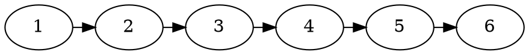
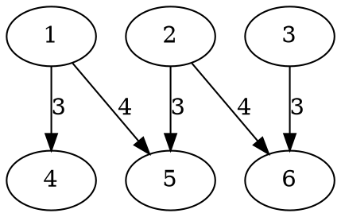

# Bazy danych - ćwiczenia 2021

## Ściągawka
Można używać LaTeX: \$\polecenie\$
leftarrow \leftarrow $\leftarrow$
select \sigma $\sigma$
project \Pi $\Pi$
inner join \bowtie $\bowtie$
cross product \times $\times$
rename \rho $\rho$
klamry { } $\{ \}$

## 9 marca

### Deklaracje

:::danger
|                      |  1  |  2  | 3a  | 3b  | 3c  | 3d  |  4  |
| -------------------: | :-: | :-: | :-: | :-: | :-: | :-: | :-: |
|     Wojciech Adamiec |  X  |  X  |  X  |  X  |  X  |  X  |  X  |
|     Karol Cieślawski |  X  |  X  |  X  |  X  |  X  |  X  |  X  |
| Przemysław Hoszowski |  X  |  X  |  X  |  X  |  X  |  X  |  X  |
|       Karol Kęciński |  X  |  X  |  X  |  X  |  X  |  X  |  X  |
|        Dominik Komła |  X  |  X  |  X  |  X  |  X  |     |     |
|    Grzegorz Maliniak |  X  |  X  |  X  |  X  |  X  |  X  |  X  |
|   Michał Mikołajczyk |     |  X  |  X  |  X  |  X  |  X  |  X  |
|    Barbara Moczulska |  X  |  X  |  X  |     |  X  |     |     |
|         Antoni Nowak |     |     |  X  |  X  |     |  X  |  X  |
|       Łukasz Orawiec |  X  |  X  |  X  |  X  |  X  |  X  |     |
|       Natalia Piasta |     |  X  |  X  |  X  |  X  |  X  |  X  |
|         Łukasz Pluta |  X  |  X  |  X  |  X  |  X  |  X  |     |
|   Przemysław Stasiuk |     |  X  |  X  |  X  |  X  |  X  |  X  |
|     Dominik Trautman |  X  |  X  |  X  |  X  |  X  |  X  |  X  |
|        Jan Wańkowicz |  X  |  X  |  X  |  X  |  X  |  X  |     |
|     Michał Wójtowicz |     |  X  |  X  |  X  |  X  |  X  |  X  |
|         Nikola Wrona |  X  |  X  |  X  |  X  |  X  |  X  |  X  |
|           Adam Zyzik |  X  |  X  |  X  |  X  |  X  |  X  |     |
:::

### Rozwiązania

#### 1
Łukasz Orawiec

Operator $op$ jest monotoniczny, jeśli 

$R \subseteq R' \ \Rightarrow \ op(R) \subseteq op(R')$

dla dowolnych relacji $R$, $R'$.

<br/>

Operatory monotoniczne:
* $\pi_\alpha(R), \ \rho_S(R)$ -- zawsze zwracają relację o tej samej liczbie krotek co $R$

* $\sigma_F(R)$ - po dodaniu krotek do $R$ wszystkie krotki poprzednio spełniające warunek $F$ dalej go spełniają

* $R \times S$ -- po dodaniu krotek do $R$ lub $S$, w ich iloczynie kartezjańskim znajdą się nowe krotki, a stare się nie zmienią

* $R \cup S$ -- tak jak wyżej

<br/>

Operator niemonotoniczny:
* $R \setminus S$ -- po dodaniu nowych krotek do $S$ w różnicy tych relacji liczba krotek może się zmniejszyć

<br/>

Złożenia operatorów monotonicznych są monotonicznymi zapytaniami, więc operatora $\setminus$ nie można wyrazić za pomocą algebry relacji z operatorami $\pi, \sigma, \rho, \times, \cup$.


#### 2
Adam Zyzik

Weźmy $X = Z = \{1\}, Y = \emptyset$.

Wtedy $(X \times \rho_{Y(A_Y)}(Y) \times \rho_{Z(A_Z)}(Z)) = \emptyset$, a $X \cap (Y \cup Z) = \{1\}$.

Wyrażenie możemy zapisać tak: $X \setminus ((X \setminus Y) \setminus Z)$

#### 3a
Barbara Moczulska

$G_{count_{sok}(bar)}(\pi _{bar,sok}(B \Join P))$

$(\pi _{bar,sok}(B \Join P))$ zwraca relację, zawierającą takie listy barów i soków, że w barze podaje się sok oraz chodzi tam jakaś osoba.

$G_{count_{sok}(bar)}(\pi _{bar,sok}(B \Join P))$ zwraca relację: bar do którego chodzi jakaś osoba, n sokow podawanych w tym barze


#### 3b
Michał Mikołajczyk
:::info
Treść zadania:

:::
$L$ -- **osoba** lubi **sok**
$P$ -- **sok** jest podawany w **barze** w **cenie**
$L \Join P$ -- złączenie po **sok** -- krotki (osoba, sok, bar, cena)
$\pi_{osoba,bar}\ \sigma_{n \geq 5}\ G_{count_{sok}(osoba,bar)}(L \Join P)$

#### 3c
Karol Kęciński


$\pi_{osoba, sok, cena}(P \Join B)$ <- Operator $\pi$ zwraca Krotki (osoba, sok, cena), z osobób osoba, które bywają w barze w którym podają sok sok z ceną cena. Nie interesuje nas, w którym konkretnym barze jest podawany ten sok, tylko jego minimalna cena spośród wszystkich barów w których bywa dana osoba. Operator $\pi$ eliminuje też powtórzenia.

Dla tych samych osób i soków ceny mogą być różne, np. (o1, s1, c1), (o1, s1, c2), Więc chcemy zwrócić krotki z minimalną ceną (o1, s1, min(cena)). 

Skorzystamy z operatora agregacji i grupowania $G_{min_{cena}(osoba, sok)}$.

Ostateczne zapytanie wygląda tak:

$G_{min_{cena}(osoba, sok)}(\pi_{osoba, sok, cena}(P \Join B))$

#### 3d
Nikola Wrona


$\pi_{osoba, sok, bar}(P \Join G_{min_{cena}(osoba, sok)}(B \Join P))$

$B(osoba, bar)$ - osoba bywa w bar
$P(sok, bar, cena)$ - w bar podają sok w cenie cena za porcję
$B \Join P$ - zwraca tabelę $(osoba, bar, sok, cena)$
$G_{min_{cena}(osoba, sok)}(B \Join P)$ - zwraca $(osoba, sok, cena)$
Następnie wykonujemy złączenie naturalne z $P$, dostajemy $(osoba, sok, bar, cena)$ i używając rzutu wypisujemy krotki $(osoba, sok, bar)$


#### 4
a. Dla każdego filmu między 1960 a 1970 rokiem wypisz jego tytuł, nazwisko reżysera i gatunek (genre).
Michał Wójtowicz
```
M = (rho id->movie_id movies) ⨝ movies_directors
  ⨝ movies_genres ⨝ (rho id->director_id directors)
M2 = pi name, last_name, genre, year M
M3 = sigma year ≥ 1960 ∧ year ≤ 1970 M2
M4 = pi name, last_name, genre M3
M4
```

b. Wypisz imiona i nazwiska aktorów, którzy dokładnie raz zagrali w jakimś filmie Quentina Tarantino.
Karol Cieślawski
```
X = σ xdir=78273 (π xdir (ρ xdir ← director_id (movies_directors)) ⨝ (ρ xid←actor_id, xmov_id←movie_id, xr←role (roles)))
Y = σ ydir=78273 (π ydir (ρ ydir ← director_id (movies_directors)) ⨝ (ρ yid←actor_id, ymov_id←movie_id, yr←role (roles)))
Z = X ⨯ Y
R = (π xid (σ xid = yid ∧ xmov_id ≠ ymov_id  (Z)))
π first_name, last_name (actors - ((ρ id←xid ( R ))⨝actors))
```

c. Wypisz imiona i nazwiska aktorów, którzy wyreżyserowali film, w którym grali.
Przemysław Stasiuk
```
A = π first_name, last_name, movie_id (movies ⨝ roles ⨝ (ρ actor_id←id actors))
B = A ⨝ movies_directors
C = B ⨝ directors
D = π first_name, last_name (C)
D
```

d. Wypisz tytuły filmów, które są gatunku Drama ale jednocześnie nie Sci-Fi.
Grzegorz Maliniak
```
A = π movie_id (σ genre = 'Drama' (movies_genres))
B = π movie_id (σ genre = 'Sci-Fi' (movies_genres))
C = A - B
D = π name ((ρ id ← movie_id (C)) ⨝ movies)
D
```

e. Wypisz pełne dane filmów z najniższą wartością atrybutu rank.
```
R = (ρ only_ranks (π rank movies))
M = (movies ⨯ R)
A = (π id, name, year, movies.rank (σ (movies.rank > only_ranks.rank) M))
Result = (movies - A)
Result

```

Natalia Piasta

f. Wypisz nazwiska aktorów, którzy zagrali taką samą rolę w conajmniej trzech różnych filmach.
Antoni Nowak

```
π actors.last_name 
  (actors ⨝ actors.id = roles.actor_id 
    (σ n >2 
      (γ roles.actor_id; count(roles.movie_id) -> n 
        (π actor_id,movie_id
          (σ actor_id = a1 ∧ movie_id ≠ m1 ∧ role = r1
            (roles ⨯ ρ a1←actor_id,m1←movie_id,r1←role roles))))))
```

Prościej:
```
π actors.last_name 
  (actors ⨝ actors.id = roles.actor_id 
    (σ n >2 
      (γ roles.actor_id, roles.role; count(roles.movie_id) -> n roles)))
```


g. Wypisz nazwiska reżyserów, którzy kręcą wyłacznie horrory.
Przemysław Hoszowski
```
π directors.last_name

(((π id directors) - 
-- odejmujemy tych co nakręcili film inny niż horror
(π movies_directors.director_id	 
	((σ genre != 'Horror' movies_genres) 
	⨝ movies_directors)))
⨝ directors)
```

h. Wypisz nazwiska rezyserów, którzy nakręcili film, w którym wśród aktorów jest dokładnie jedna kobieta.


Dominik Trautman
```
π last_name 
    (directors ⨝ id=director_id 
        (movies_directors ⨝ 
            (σ kobiety=1 
                (γ movie_id; count(gender)→kobiety 
                    π movie_id, actor_id, gender (σ gender = 'F' (roles ⨝ actor_id = id actors))))))
```


### Tabela deklaracji

:::info
:exclamation: W przypadku, gdy można zgłaszać chęć prezentacji zadania:

Gotowość rozwiązania zadania należy wyrazić poprzez postawienie X w odpowiedniej kolumnie! Jeśli pożądasz zreferować dane zadanie (co najwyżej jedno!) oznacz je znakiem ==X== (`==X==`).
:::


:::info
Gotowość rozwiązania zadania należy wyrazić poprzez postawienie X w odpowiedniej kolumnie!
:::

:::success
|                      |  1  |  2  |  3  |  4  |  5  | 6.1 | 6.2 | 6.3 | 6.4 |  7  |
| -------------------: | :-: | :-: | :-: | :-: | :-: | :-: | :-: | :-: | :-: | :-: |
|     Wojciech Adamiec |     |     |     |     |     |     |     |     |     |     |
|     Karol Cieślawski |     |     |     |     |     |     |     |     |     |     |
| Przemysław Hoszowski |     |     |     |     |     |     |     |     |     |     |
|       Karol Kęciński |     |     |     |     |     |     |     |     |     |     |
|        Dominik Komła |     |     |     |     |     |     |     |     |     |     |
|    Grzegorz Maliniak |     |     |     |     |     |     |     |     |     |     |
|   Michał Mikołajczyk |     |     |     |     |     |     |     |     |     |     |
|    Barbara Moczulska |     |     |     |     |     |     |     |     |     |     |
|         Antoni Nowak |     |     |     |     |     |     |     |     |     |     |
|       Łukasz Orawiec |     |     |     |     |     |     |     |     |     |     |
|       Natalia Piasta |     |     |     |     |     |     |     |     |     |     |
|         Łukasz Pluta |     |     |     |     |     |     |     |     |     |     |
|     Dominik Trautman |     |     |     |     |     |     |     |     |     |     |
|        Jan Wańkowicz |     |     |     |     |     |     |     |     |     |     |
|         Nikola Wrona |     |     |     |     |     |     |     |     |     |     |
|           Adam Zyzik |     |     |     |     |     |     |     |     |     |     |
:::

## 16 marca

### Deklaracje

:::danger
|                      |  1  |  2  |  3  |  4  |  5  | 6.a | 6.b | 6.c | 6.d |  7  |
| -------------------: | :-: | :-: | :-: | :-: | :-: | :-: | :-: | :-: | :-: | :-: |
|     Wojciech Adamiec |     |==X==|     |==X==|==X==|==X==|==X==|==X==|==X==|     |
|     Karol Cieślawski |==X==|==X==|     |==X==|==X==|==X==|==X==|==X==|==X==|     |
| Przemysław Hoszowski |     |==X==|==X==|==X==|==X==|==X==|==X==|==X==|==X==|     |
|       Karol Kęciński |     |==X==|==X==|==X==|==X==|==X==|==X==|==X==|==X==|==X==|
|        Dominik Komła |     |==X==|==X==|==X==|==X==|==X==|==X==|==X==|==X==|==X==|
|    Grzegorz Maliniak |     |==X==|     |==X==|==X==|==X==|==X==|==X==|==X==|==X==|
|   Michał Mikołajczyk |     |==X==|==X==|==X==|==X==|==X==|==X==|==X==|==X==|     |
|    Barbara Moczulska |     |==X==|     |==X==|==X==|==X==|==X==|     |==X==|==X==|
|         Antoni Nowak |     |==X==|==X==|==X==|==X==|     |     |     |     |     |
|       Łukasz Orawiec |     |==X==|     |==X==|==X==|==X==|==X==|==X==|==X==|==X==|
|       Natalia Piasta |     |     |     |     |     |     |     |     |     |     |
|         Łukasz Pluta |     |==X==|==X==|==X==|==X==|==X==|==X==|==X==|==X==|==X==|
|     Dominik Trautman |     |     |     |==X==|==X==|==X==|==X==|==X==|==X==|==X==|
|        Jan Wańkowicz |     |==X==|==X==|==X==|==X==|==X==|==X==|==X==|==X==|==X==|
|         Nikola Wrona |     |==X==|==X==|==X==|==X==|==X==|==X==|==X==|==X==|==X==|
|           Adam Zyzik |     |     |     |     |     |     |     |     |     |     |
:::


### Rozwiązania

#### 1

Karol Cieślawski

:::info

:::

Wystarczy, że będziemy w stanie przedstawić każdy z operatorów $\pi, \sigma, \rho, \times, \cup$ za pomocą rrk albo rrd.

* (rrk) $\pi_{a_1, ..., a_n}R \equiv \{r'|\exists_{r} R(r) \wedge r.a_1=r'.a_1 \wedge \cdots \wedge r.a_n=r'.a_n \}$

* (rrk) $\rho_{b_1, ..., b_n}R \equiv \{r'|\exists_{r} R(r) \wedge r.a_1=r'.b_1 \wedge \cdots \wedge r.a_n=r'.b_n \}$

* (rrd) $A\times B\equiv \{(a_1,\cdots,a_n,b_1,\cdots,b_n)| A(a_1,\cdots,a_n) \wedge B(b_1,\cdots,b_n) \}$

* (rrk) $A \setminus B\equiv \{a|A(a) \wedge \neg B(a) \}$

* $\sigma_F(R)$
    * dla $F=k_1 \oplus k_2$
        $\sigma_F(R) \equiv \{r| R(r) \wedge r.k_1 \oplus r.k_2 \}$
        
    * dla $F = A \wedge B$ możemy zapisać wyrażenie jako $\sigma_A(\sigma_B(R))$, które jest równoważne

    * Negacja
        niech $A = \sigma_F(r)$, które umiemy otrzymać. Wtedy
        $\sigma_{\neg F}(R) \equiv \{r|R(r) \wedge \neg A(r)\}$
        
    * Alternatywa
        $F = A \lor B = \neg(\neg A \wedge \neg B)$
    * Alternatywa
        $A_i = \sigma_{F_i}(R)$
        $\sigma_{F_1\lor F_2}(R) = \{r| A_1(r) \lor A_2(r)\}$
        
Złożenia otrzymujemy składając powyższe definicje.

#### 2

:::info
Wojciech Adamiec
:::
:::info

:::
Kiedy atrybut $Z$ relacji $S$ spełnia właśność klucza obcego wskazującego na atrybut $A$ relacji $R$?

Wtedy i tylko wtedy, gdy:
$\forall s\in S: (\neg isnull(s.z) \land \exists r \in R: r.a = s.z )$

Równoważnie, w notacji zbiorowej:
$\{s|s\in S \land \neg isnull(s.z) \land \exists r \in R: r.a = s.z  \} = S$

Aktualnie nasz zbiór jest pełen (zawiera wszystkie krotki z $S$), wtw gdy $Z$ spełnia warunek zadania. Musimy zanegować formułę w środku, aby zbiór był pusty gdy warunki zadania są spełnione:

$\{s|s\in S \land \neg(\neg isnull(s.z) \land \exists r \in R: r.a = s.z ) \} = \emptyset$

Można uprościć jeszcze formułę logiczną:

$\{s|s\in S \land (isnull(s.z) \lor \neg(\exists r \in R: r.a = s.z )) \} = \emptyset$

#### 3

Karol Kęciński

:::info

:::


:::info
Pierwsze zapytanie zwraca największe *a* w relacji *R* spośród wszystkich *a*.
Ta formuła nie jest zależna od dziedziny, ponieważ rozpatrujemy tylko takie elementy które należą do relacji *R*.
:::

:::success
Formuła w algebrze relacji:

$\pi_{a}(R \setminus \pi_{a,b}(\sigma_{a<a'}(R \times \rho_{R(a',b')}R)))$
:::


:::info
Zwraca takie pary *(a, b)*, że dla każdego *c* znajdującego się w relacji *T*, *c* jest w relacji w parze z *a* lub *b* lub relacja *T* jest pusta. 
Ta formuła jest zależna od dziedziny: gdyby T była pusta, otrzymalibyśmy wszystkie możliwe pary *(a, b)*.
:::

:::danger
Formuły w algebrze relacji zwracają zbiór skończony, więc nie da się zapisać równoważnej formuły w algebrze relacji.
:::


#### 4

Barbara Moczulska


odpowiedź 1 i 3

#### 5

Łukasz Orawiec

Osoby chodzące tylko do jednego baru.

1. $\{o \ \vert \ (\exists b)(B(o,b) \ \land \ \lnot (\exists b')(B(o,b')))\}$

    :::danger
    Zwróci osoby, które bywają w pewnym barze i nie bywają w żadnym barze, czyli zbiór pusty.
    :::
    
<br/>

2. $\{o \ \vert \ (\exists b)(B(o,b))\}$
    
    :::danger
    Zwróci osoby bywające w przynajmniej jednym barze.
    :::
    
<br/>

3. $\{o \ \vert \ (\exists b)(B(o,b) \ \land \ \lnot (\exists b')(b \neq b' \ \land \ B(o,b')))\}$

    :::success
    Zwróci oczekiwany wynik.
    :::
    
    
<br/>

4. $\{o \ \vert \ (\exists b)(B(o,b) \ \land \ \lnot (\exists b', o')(b \neq b' \ \land \ o = o' \ \land \ B(o',b')))\}$


    :::success
    Zwróci oczekiwany wynik.
    :::

#### 6a

Dominik Trautman


$\{ a\in A | (\forall_{ f, f'\in F} \exists_{r, r' \in R})(\\f.idf = r.idf \land f'.idf = r'.idf \land r.pseudo=a.pseudo \land r'.pseudo=a.pseudo$ $\Rightarrow f.rokProd = f'.rokProd) \}$

#### 6b

Przemysław Hoszowski

$\{f | f \in F \land \neg(\exists f_2)( f_2 \in F \land f_2.rezyser = f.rezyser \land f_2.rokProd > f.rokProd) \}$

#### 6c

Nikola Wrona


$\{{Z^{[pseudo, idf, gaza]}| (\exists r)(r \in R \wedge r.pseudo=Z.pseudo \wedge r.idf = Z.idf \wedge r.gaza = Z.gaza)}$
${\wedge \neg(\exists r')(r' \in R \wedge r.pseudo \neq r'.pseudo \wedge r.idf = r'.idf \wedge r.gaza<r'.gaza)}\}$


#### 6d

Michał Mikołajczyk

:::info
Podaj pełne krotki aktorów, którzy nigdy nie obniżyli swojej minimalnej gaży (w późniejszych latach mogła ona najwyżej rosnąć). Na wynik nie wpływają lata, w których aktor nie podał minimalnej gaży. 
:::

$\{a \mid A(a) \wedge (\forall m_1,m_2 \in M) (\\
\;\;\;\;\;\;\; (m_1.pseudo = m_2.pseudo=a.pseudo \wedge m_1.rok < m_2.rok ) \implies\\
\;\;\;\;\;\;\;\;\;\;\;\;\;\; m_1.minGaza \leq m_2.minGaza\\
) \}$

#### 7

Łukasz Pluta

Weźmy relację D, która ma jedną kolumnę o nazwie 'x' i wartości {1, 2, NULL} w niej.

Niech $Q = \sigma_{x > 1}$

Teraz $Q(rep(D))$ zwróci wszystkie krotki z zakresu integer(zakładając że x było typu integer) oprócz 0 i 1, natomiast $rep(Qd)$ jest niezdefiniowane bo nie wiemy co zwraca selekcja dla NULLa.

## 23 marca

### Rozwiązania

#### 1

Nowak	Antoni

Stwórzmy graf ze ścieżką długości 5.



Możliwe widoki:
|P3|x|y|
:-:|:-:|:-:|
||1|4
||2|5|
||3|6|

|P4|x|y|
:-:|:-:|:-:|
||1|5|
||2|6|

Załóżmy, że istnieje zapytanie $P'_5(x,y)$ zbudowane z perspekty $P_3$ i $P_4$. Np: $\exists s_1,s_2P_4(x,s_2)\wedge P_3(s_1,s_2) \wedge P_4(s_1,y)$

Stwórzmy drugi graf który dla zapytań poprawnych w G_1 zawsze jest błędny w G_2.



#### 2

Hoszowski	Przemysław

$$\{(x,y) | (\exists b)(P_4(x,b) \land (\forall_c)(P_3(c,b)=>P_4(c,y)))\}
$$
$P_5(x,y) => w(x,y)$
Weźmy dowolną drogę $x, c_0, c_1, c_2, b, y$. Wtedy dla dowolnego c dla którego istnieje ścieżka dł. 3 do b. Dodając krawędź (b,y) otrzymujemy ścieżkę dł 4.
$w(x,y) => P_5(x,y)$
Weźmy takie b dla którego zachodzi warunek. Weźmy ścieżkę $x, c_1, c_2, c_3, b$ Istnieje więc ścieżka dł 4 między $c_1$ a y, więc istnieje ścieżka dł 5 między x,y

#### 3

Mikołajczyk	Michał

:::info


:::

##### 1.
Niech graf $G$ będzie zbudowany z jednego, zapętlonego wierzchołka:


Wtedy dla dowolnego grafu $G'$ istnieje taki homomorfizm, że:
$\forall v \in V(G'): v \rightarrow x$

W ten sposób każda para wierzchołków w $G'$, po zastosowaniu homomorfizmu zostanie zamieniona na wierzchołek $x$ połączony krawędzią ze sobą. W szczególności, te wierzchołki, które były połączone krawedzią w $G'$, będą złączone po zastosowaniu homomorfizmu.


##### 2.
Kontrprzykład:


Homomorfizm z $G_1$ do $G_2$:
$1 \rightarrow 1$
$2 \rightarrow 2$
$3 \rightarrow 1$
$4 \rightarrow 2$

Homomorfizm z $G_2$ do $G_1$:
$1 \rightarrow 1$
$2 \rightarrow 2$

Zatem grafy $G_1$ i $G_2$ są homomorficznie równoważne. 

>Izomorfizm to taka bijekcja, która jest homomorfizmem, i jej funkcja odwrotna też jest homomorfizmem.

Już po ilości wierzchołków widać jednak, że nie są izomorficzne - nie istnieje między nimi żadna bijekcja.

Zatem warunek mówiący, że grafy są homomorficznie równoważne nie jest równoważny z tym, że istnieje izomorfizm $f: G_1 \rightarrow G_2$. 


#### 4

Maliniak	Grzegorz

Zacznijmy od spostrzeżenia, że każdy graf cykliczny parzysty jest dwudzielny (można go tak narysować). Dodatkowo każdy graf dwudzielny jest homomorficznie równoważny z K2. Dodatkowo, równoważność z definicji jest relacją zwrotną, symetryczną i przechodnią, zatem dla dowolnych dwóch cykli parzystych G1 i G2: G1 jest homomorficznie równoważny z K2, G2 jest homomorficznie równoważny z K2, więc G1 jest homomorficznie równoważny z G2.

#### 5

Orawiec	Łukasz

* $G_1$ -- baza danych z jedną relacją $E$ reprezentującą graf $G$
* $G_2$ -- baza danych z jedną relacją $E = \{(r, g), (r, b), (g, r), (g, b), (b, r), (b, g)\}$ reprezentującą pary różnych kolorów

<br/>

Załóżmy, że istnieje homomorfizm $h: G_1 \rightarrow G_2$. Weźmy dowolną parę wierzchołków $(x, y)$ z grafu $G$.

$$
G_1 \models E(x, y) \ \implies \ G_2 \models E(h(x), h(y)),
$$
czyli jeśli w grafie $G$ wierzchołki są połączone krawędzią, to funkcja $h$ przyporządkowuje im różne kolory. 

Homomorfizm $h$ wyznacza więc prawidłowe 3-kolorowanie grafu $G$. 


<br/>

Załóżmy, że istnieje 3-kolorowanie grafu $G$. Wtedy funkcja $h: \text{dom}(G_1) \rightarrow \text{dom}(G_2)$ przyporządkowująca każdemu wierzchołkowi $G$ jego kolor w tym kolorowaniu jest homomorfizmem. 

#### 6

Komła	Dominik

Rozważmy dwie bazy $B1$ i $B2$. $B1$ ma dwie relacje $A$ i $B$. Relacja $A$ ma 2 krotki $T,N$ oraz $N,T$. Natomiast relacja B ma 8 krotek, kolejno $T,T,T$; $T,T,N$ itd. (wszystkie trójki złożone z $N$ i $T$ oprócz $N,N,N$). Baza $B2$ ma dwie relacje $A$ i $B$. Rozpatrzmy funkcję $f$ będącą bijekcją przeprowadzającą zmienne i ich zaprzeczenia i dodatkowe wartości $P1,P2$ na liczby naturalne. Teraz dla każdej zmiennej q dodajemy w relacji A krotkę $f(q),f(\neg q)$ oraz krotkę $f(P1),f(P2)$. Każdą klauzulę zawierającą dwie lub mniej zmienne zamieniamy na dwie klauzule w jednej dopełniając “puste” miejsca za pomocą $P1$, a w drugiej za pomocą $P2$. Teraz dla każdej klauzuli zawierającej zmienne $p,q,r$ (lub specjalne wartości $P1,P2$) dodajemy krotkę $f(p), f(q), f(r)$ do relacji $B$. Stąd, jeśli będziemy mieli homomorfizm z $B2$ w $B1$, to mamy rozwiazany $3SAT$.

## 30 marca

### Rozwiązania

#### 1

Jan Wańkowicz

Weźmy takie zapytanie $Q()$, dla którego $G$ jest bazą kanoniczną oraz $D$ będące cyklem trzyelementowym. Teraz to, że $Q()$ jest spełnialne w $D$ jest równoważne z tym, że istnieje homomorfizm z $G$ w $D$ (twierdzenie z wykładu). Wiemy zaś z ostatniej listy, że przy użyciu takiego homomorfizmu możemy rozwiązać problem 3-kolorowania. 

Problem ewaluacji zapytań jesteśmy w stanie zrobić w czasie wielomianowym tylko przy założeniu, że długość zapytania jest stałą. W naszym przypadku długość zapytania jest proporcjonalna do liczby krawędzi w grafie $G$, a więc nie jest stałą.

#### 2

Dominik Komła


Zakładam, żę chodzi o ścieżki <=2^i-1. Indukcja:
Baza i=1: $T_1=E \cup \emptyset = E$
Krok: Załóżmy, że $T_{n+1}(x,y)$ będzie zapytaniem czy istnieje ścieżka z x do y dł. mniejszej równej 2^n. Weźmy dowolne dwa wierzchołki u i v, takie, że istnieje między nimi ścieżka długośći mniejszej równej $2^{n+1}$ (jeśli jest to ścieżka dł 1 to dodamy wierzchołki u,v z warunku 1). Niech a będzie takim wierzchołkiem na tej ścieżce, że dł. ścieżki między u i a oraz między a i v jest mniejsza, równa $2^n$ (taki wierzchołek istnieje, bo odległość między u i v jest mniejsza równa $2^n$) Stąd $T(u,v)=T(u,a),T(a,v)$.

#### 3.1


Dominik Trautman 

$T(x)$ :-- $E(n, x)$
$T(x)$ :-- $E(m, x)$
$T(x)$ :-- $T(z), E(z, x)$ 

#### 3.2

Barbara Moczulska

$T(Y)$ $:-$ $N(n, Y), N(m, Y)$

$N(X, Y)$ $:-$ $E(X, Y)$
$N(X, Y)$ $:-$ $E(X, Z), N(Z, Y)$


#### 3.3

Wojciech Adamiec

```=
DoublePath(x, y, z) :-- E(z, x), E(z, y)
DoublePath(x, y, z) :-- E(k, x), E(j, y), DoublePath(k, j, z)
T(x, y)             :-- DoublePath(x, y, n)
```
Wizualizacja:

#### 3.4

Łukasz Pluta

$Ł(a, b, c, d) :- E(a, b), E(c, x), S(x, d)$
$Ł(a, b, c, d) :- E(a, x), E(c, y), Ł(x, b, y, d)$

$R(x, y) :- Ł(n, x, n, y)$
$R(x, y) :- Ł(n, y, n, x)$

#### 4

Adam Zyzik

Skorzystamy z $N(x, y), P(x, y)$ z wykładu.

$N(x, y) :- E(x, y)$
$N(x, y) :- E(x, z), P(z, y)$
$P(x, y) :- E(x, z), N(z, y)$

$Q() :- N(x, x)\quad$ (istnieje cykl nieparzysty)

#### 5

Nikola Wrona


1. Weźmy dowolną klikę. Każde zapytanie które jesteśmy w stanie dla niej skonstruuować w Datalogu będzie prawdziwe (bo wszystkie formuły atomowe są spełnione, a zapytania tworzymy tylko przy użyciu koniunkcji i rekurencji, ale to nie spowoduje powstania fałszu). Naszym celem jest natomiast skonstruuowanie zapytania, które będzie spełnione wtw gdy NIE ma scieżki z n do m. Widzimy zatem, że dla kliki nasze zapytanie powinno zwrócić fałsz (bo dowolne dwa wierzchołki z klik są połączone - jest między nimi krawędź), a zwróci prawdę. Sprzeczność

Kontrprzykład: Klika $K_{3}$


2.
 
Wiemy, że dla $K_{3}$ dowolne zapytanie w Datalogu zwróci nam prawdę. Z kolei liczba wierzchołków w $K_{3}$ jest nieparzysta, więc zapytanie z treści polecenia powinno zwrócić nam fałsz. Jest to niemożliwe. 